# Ops Agent Product Requirements Document

## Current Documents Module Baseline

The current product baseline for document information extraction is [production-llm-document-extraction-backend-spec.md](D:\Self_study\computer_science\Personal_project\bank_document_processing_agent\docs\production-llm-document-extraction-backend-spec.md). The MVP Documents workflow is upload -> store -> queue -> preprocess -> GPT-4o Vision structured extraction -> strict validation -> one retry -> normalize -> editable table -> manual review -> approve/reject -> approved-only persistence -> audit -> UUID search. This is an inference-only LLM workflow and excludes dataset preparation, OCR model training, model benchmarking, and model evaluation.

## 1. Product Overview

- Product: Banking Document Processing Agent ("Ops Agent")
- Product type: Internal operations workflow platform for banking document intake, extraction, validation, review, and decision support
- Primary users: operations staff, compliance analysts, fraud analysts, branch support teams, back office staff
- Product owner intent: reduce manual document handling effort while preserving auditability, policy control, and human accountability
- Core value proposition: reduce manual document handling, standardize review quality, and make every operational decision evidence-backed and auditable
- Operating model: queue-based case processing with explicit workflow states, policy-driven routing, and mandatory human review for regulated or high-risk outcomes
- Primary business domain: retail KYC onboarding, income verification, bank statement analysis, and loan document intake
- System boundary: Ops Agent orchestrates document processing and review; it does not replace the bank's core system of record for customer onboarding, lending, or compliance adjudication

## 2. Problem Statement

Bank operations teams spend substantial time receiving documents from multiple channels, checking completeness, manually keying fields, comparing data across documents, routing exceptions, and documenting decisions for audit. This creates five operational failures:

1. Long turnaround time for onboarding and credit workflows because documents arrive in inconsistent formats and queues.
2. High manual review cost because staff retype fields, chase missing pages, and repeat the same validation checks.
3. Uneven decision quality because review standards vary by team, branch, and analyst.
4. Weak operational visibility because case status, exception reasons, and reviewer actions are fragmented across email, spreadsheets, and line-of-business tools.
5. Elevated risk because document changes, overrides, and approvals are not consistently traceable with evidence.

Ops Agent solves this by making document processing a controlled case workflow: ingest documents, classify them, extract structured fields, validate them against policy rules, route exceptions to the correct team, require human review where needed, and preserve a complete audit trail from upload to final disposition.

## 3. Business Goals

### Goals

1. Increase straight-through processing for low-risk, standard retail document workflows.
2. Cut manual handling time for KYC, income verification, and loan document intake.
3. Standardize review and escalation workflows across operations teams.
4. Provide evidence-backed field extraction and validation results for every case.
5. Preserve banking-grade auditability, role-based access, and review controls.

### Non-goals

1. Replace core banking, LOS, or case management systems in MVP.
2. Fully automate high-risk fraud, sanctions, or adverse action decisions.
3. Support all banking document types in the first release.
4. Remove humans from compliance-sensitive approvals.

## 4. In-Scope Users and Personas

### Operations staff

- Job: process large volumes of onboarding, statement, and lending documents quickly.
- Need: fast case creation, completeness checks, extraction output, clear exception queue, and simple correction tools.

### Compliance analysts

- Job: verify KYC documentation, identity consistency, and policy adherence.
- Need: document provenance, extracted identity fields, mismatch alerts, evidence references, and controlled approval history.

### Fraud analysts

- Job: review suspicious or manipulated documents and investigate anomalous patterns.
- Need: escalation queues, image quality/manipulation flags, duplicate document indicators, and mandatory human decisioning.

### Branch support teams

- Job: upload or forward customer documents from branch interactions and resolve missing information requests.
- Need: simple intake channel, status visibility, checklist of required documents, and feedback on missing/invalid items.

### Back office staff

- Job: complete downstream fulfillment and maintain records after a case decision.
- Need: final status, approved data package, exception notes, and retrieval of audit records.

## 5. In-Scope Use Cases

### Must-have for MVP

1. Retail customer onboarding KYC document intake and review.
2. Income verification using payslips and employment letters.
3. Bank statement intake and basic statement analysis for affordability checks.
4. Loan application document completeness and packaging for downstream underwriting review.

### Should-have for beta

1. Small business onboarding documents.
2. Utility bill and proof-of-address validation.
3. Basic fraud flags for duplicate or inconsistent submitted documents.
4. SLA and queue management for team supervisors.

### Future scope

1. Invoice and trade document review.
2. Corporate KYC with beneficial ownership structures.
3. Advanced transaction categorization and cash-flow analysis from statements.
4. Multi-language document packs.
5. Cross-case entity linking and recurring customer document reuse.

### Automation boundary by use case

| Use case | Automation stance in MVP | Human review stance in MVP | Priority |
|---|---|---|---|
| Retail KYC onboarding | Partial automation only: intake, classification, extraction, completeness checks, freshness checks, and recommendation generation | Final approval mandatory; all mismatches, missing docs, screening concerns, and critical exceptions require human review | Must-have |
| Income verification | Partial automation only: payslip extraction, bank statement extraction, variance checks, and recommendation generation | Human review mandatory for major income variance, missing periods, employer mismatch, materially corrected values, or unclear ownership | Must-have |
| Bank statement analysis | Partial automation only: statement typing, page detection, account-holder extraction, date-range extraction, and basic transaction summary | Human review mandatory when pages are missing, parsing confidence is low, account ownership is unclear, or affordability outputs drive lending decisions | Must-have |
| Loan document intake | Partial automation only: packet completeness, consent detection, signature presence detection where supported, and downstream packaging recommendation | Human review mandatory before packet is marked ready for underwriting if any required doc is missing, ambiguous, expired, or corrected | Must-have |
| Fraud-related document review | No automatic disposition | Fraud analyst review mandatory | Never fully automated |
| Sanctions / PEP / AML review | No automatic disposition | Compliance analyst review mandatory | Never fully automated |

## 6. MVP Scope

### MVP workflows in scope

1. `kyc_onboarding`
2. `income_verification`
3. `bank_statement_analysis`
4. `loan_document_intake`

### Document types in scope for MVP

1. Government ID: passport, national ID card, driver's license
2. Proof of address: utility bill, bank-issued address letter, government address letter
3. Income proof: payslip, salary certificate, employment letter
4. Bank statement: PDF statements and scanned statement images
5. Loan support forms: signed application form, consent form, basic supporting letter

### Explicitly out of MVP scope

1. Trade finance document packs
2. Invoices for trade or AP automation
3. Corporate ownership structures and UBO graph analysis
4. Handwriting-heavy forms as a primary document type
5. Final adverse credit decision automation

## 7. Product Principles

1. Human accountability for regulated decisions.
2. Evidence-backed extraction rather than black-box output.
3. Queue-based operations, not ad hoc inbox processing.
4. Policy-driven routing and validation.
5. Complete traceability for every case, document, correction, escalation, and close action.

## 8. Workflow Requirements

```mermaid
flowchart LR
    A["Document received"] --> B["Case created"]
    B --> C["Document registered and stored"]
    C --> D["Classify document type"]
    D --> E["Extract fields and metadata"]
    E --> F["Run validation and policy rules"]
    F --> G{"Passes STP rules?"}
    G -- "Yes" --> H["System recommends approval package"]
    H --> I["Human approval if workflow requires it"]
    I --> J["Case closed with outcome"]
    G -- "No" --> K["Create review task"]
    K --> L["Reviewer claims task"]
    L --> M["Correct fields / request missing docs / escalate"]
    M --> N["Revalidate"]
    N --> O{"Resolved?"}
    O -- "Yes" --> I
    O -- "No" --> P["Escalate to compliance or fraud"]
    P --> Q["Manual decision"]
    Q --> J
```

### Detailed user flow from upload to final decision

1. A user or upstream system submits documents through a supported input channel with minimum metadata: workflow type, customer reference, source channel, and priority.
2. Ops Agent creates a case ID, registers each document, computes a file hash, assigns retention class, and records the intake event.
3. The system performs file checks: supported type, corruption check, password protection check, page count, and duplicate hash detection.
4. The system classifies each document into a supported type or routes it as unknown document type.
5. The system extracts required fields per document type and stores value, normalized value, confidence, and evidence reference.
6. The system runs validation rules:
   - completeness
   - cross-field consistency
   - cross-document consistency
   - format validation
   - freshness and expiration checks
   - policy routing rules
7. If all mandatory fields are present, confidence thresholds are met, no critical rule fails, and the workflow is eligible for automation, the system marks the case as validated and produces a recommended route.
8. If any mandatory field is missing, confidence is below threshold, the document is unsupported, or a policy rule fails, the system creates a review task with reason codes and queue assignment.
9. A reviewer claims the task, sees extracted fields with evidence, corrects fields if needed, and may add comments, attach reason codes, or escalate.
10. After correction, the reviewer triggers revalidation. The system reruns validation rules and updates the case status.
11. A human reviewer or authorized approver closes the case with one of the allowed outcomes: approved, rejected, or closed without decision.
12. The platform emits a full audit history and publishes structured outputs to downstream systems.

## 9. Workflow Stages and System States

The product workflow must map to these case states:

1. `received`: case created, intake metadata accepted
2. `stored`: documents registered and stored
3. `queued`: ready for processing
4. `processing`: classification, extraction, or validation in progress
5. `validated`: validation completed successfully
6. `review_required`: case requires human review
7. `in_review`: task claimed by reviewer
8. `corrected`: reviewer corrections recorded
9. `approved`: decision approved
10. `rejected`: decision rejected
11. `escalated`: transferred to specialist queue
12. `failed`: system processing failure
13. `closed`: workflow completed

## 10. Functional Requirements

### 10.1 Intake and case creation

- The system must require `workflow_type`, `priority`, and at least one supported source channel.
- The system must generate a unique case ID and unique document ID for every submission.
- The system must assign an initial queue based on workflow type, priority, and whether review is required.
- The system must reject unsupported MIME types with a machine-readable error code.
- The system must prevent document attachment to closed cases.

### 10.2 Supported input channels

#### Must-have

1. Operations portal manual upload
2. Branch upload channel
3. Secure API intake from upstream systems
4. Secure email ingestion via controlled mailbox adapter

#### Should-have

1. Core banking or LOS batch feed
2. Mobile app customer upload

#### Future

1. Partner or broker portal submission

### 10.3 Document handling

- The system must store source channel, MIME type, file hash, created timestamp, and retention class for each document.
- The system must detect exact duplicate files by hash within the same case and flag them for reviewer confirmation.
- The system must support PDFs and common image formats in MVP: `application/pdf`, `image/jpeg`, `image/png`.
- The system must flag password-protected or unreadable files into a manual exception queue.
- The system must retain the original document and never overwrite source content during processing.

### 10.4 Extraction output expectations

For every extracted field, the system must store:

1. field name
2. raw extracted value
3. normalized value
4. confidence score
5. required/not required status
6. reason code if missing or overridden
7. evidence reference including document ID and page number; bounding box when available

### 10.5 Validation rules

#### KYC onboarding

- ID name must be present.
- Date of birth must be present.
- ID number must be present.
- ID expiry date must not be in the past.
- Proof-of-address name should match ID name within configured tolerance.
- Proof-of-address issue date must be within policy freshness window.

#### Income verification

- Employer name must be present.
- Net income or gross income must be present.
- Payslip period must be present.
- Statement salary credit should align with declared employer or expected payroll pattern when statement is available.
- Documents older than configured freshness limit must fail validation.

#### Bank statement analysis

- Statement account holder name must be present.
- Statement period start and end date must be present.
- Minimum number of pages must match expected statement length if provided by issuer metadata.
- Transaction summary extraction must flag if no debits/credits can be parsed from a digital statement.

#### Loan document intake

- Required document checklist must be complete before the case can be marked ready for downstream underwriting.
- Signed consent form must be present for workflows that require it.

### 10.6 Routing and review logic

- High and critical priority cases that require review must route to `priority_review`.
- Standard review cases must route to `ops_review`.
- No case may auto-close directly from intake.
- Cases with any critical validation failure must not bypass human review.
- Cases marked as fraud suspicion, sanctions concern, identity mismatch, or altered document suspicion must route to specialist review and require human closure.

### 10.7 Human review points

Human review is mandatory for:

1. First release approval of all KYC onboarding decisions
2. Any case with low-confidence mandatory fields
3. Any failed validation with severity `high` or `critical`
4. Any document flagged as manipulated, duplicate, expired, unsupported, or incomplete
5. Any fraud, sanctions, AML, or policy exception
6. Any rejection outcome
7. Any closed-without-decision outcome

### 10.8 Actions never fully automated without human review

1. Rejection of onboarding or lending cases
2. Fraud disposition or fraud clearance
3. Sanctions or PEP true-match decisions
4. Approval of materially corrected income values
5. Override of expired-document policy
6. Closure of escalated cases

## Non-Functional Requirements

### Reliability and availability

1. The platform must persist every material case action before acknowledging success to the caller.
2. The system must support idempotent retries for case creation, document registration, review claim, correction, escalation, and close operations.
3. The workflow engine must expose visible failure states; failures must not be hidden behind silent retries.
4. Critical workflow actions must be recoverable after worker restart or service interruption.

### Performance

1. Case creation and document registration APIs should return within 2 seconds for normal-sized metadata requests, excluding large-file upload time.
2. The system should begin asynchronous processing within 1 minute of successful intake for standard priority queues.
3. Review queue pages should load with current status, reason codes, and assignee state within 3 seconds for normal operational use.
4. Audit history retrieval for a single case should return within 5 seconds under normal load.

### Auditability and explainability

1. Every state change, correction, escalation, override, and close action must create an append-only audit event.
2. Every extracted or validated field shown to a reviewer must include evidence reference and confidence or rule-result context.
3. The platform must store rule version, model version, prompt version where applicable, and actor attribution for material decisions.

### Security and privacy

1. All access must be role-based and least-privilege by default.
2. Documents and derived artifacts must be encrypted in transit and at rest.
3. Sensitive fields must be masked in logs and only shown in UI to authorized roles.
4. The system must preserve retention and legal-hold metadata per document and case.

### Operability

1. The system must expose metrics for throughput, review rate, exception rate, latency, and processing failures.
2. Operational teams must be able to identify queue backlog, aged cases, and failed-processing cases without database access.
3. Configuration changes to thresholds, rule packs, or automation boundaries must be versioned and auditable.

## Human-in-the-Loop Requirements

1. Human review is mandatory for all KYC approvals in the initial release.
2. Human review is mandatory for any case with one or more missing mandatory fields, low-confidence mandatory fields, critical validation failures, or unresolved cross-document mismatches.
3. Human review is mandatory for all sanctions, PEP, AML, fraud, document-manipulation, policy-exception, and escalated cases.
4. Any materially corrected identity, date of birth, address, employer, or income field must be attributable to a named reviewer with reason code and evidence reference.
5. Reviewers must be able to:
   claim tasks, compare extracted values to evidence, correct values, revalidate, escalate, and close cases only within their role permissions.
6. The system must not present automation output as a final decision when human approval is still required.
7. Cases with pending critical checks must remain visibly pending and cannot be shown as compliant or complete.

## Compliance-Sensitive Workflow Considerations

1. For KYC onboarding, the system must distinguish document collection, document verification, screening status, discrepancy review, and final approval as separate control steps.
2. The system must treat compliance status as an explicit state model:
   `pending`, `completed_pass`, `completed_fail`, `review_required`, `partial_compliance`, `non_compliant`.
3. No sanctions, PEP, AML, suspicious activity, or fraud-related case may be auto-cleared or auto-rejected.
4. Required documents for regulated workflows must be complete before the case can be marked compliant-ready.
5. Pending external checks must remain visible to the user and downstream systems; they must never be flattened into a pass state.
6. Any override, waiver, or exception must include policy reference, approver identity, rationale, and timestamp.
7. The system must support examiner and audit reconstruction using case data, evidence references, review actions, and immutable audit history.

## 11. Roles and Permissions

### Branch support

- Create case
- Upload documents
- View status for branch-submitted cases
- View missing document requests
- Cannot approve, reject, correct extracted fields, or see restricted fraud notes

### Operations reviewer

- View assigned queue
- Claim review task
- View extracted fields and evidence
- Correct fields
- Trigger revalidation
- Close case as approved only for workflows explicitly delegated to operations
- Cannot resolve fraud escalations or view restricted compliance-only comments

### Compliance analyst

- All operations reviewer permissions
- View compliance queues
- Escalate and resolve KYC/compliance exceptions
- Approve or reject KYC cases
- View full audit trail

### Fraud analyst

- View fraud queue
- View fraud flags and anomaly evidence
- Escalate or close fraud-reviewed cases
- Block automatic approval recommendations

### Back office processor

- View final decision package
- Download approved structured output
- Mark downstream handoff complete
- Cannot alter extraction or validation outputs

### Supervisor / team lead

- Reassign tasks
- View all queues and SLA dashboards
- Override queue priority with reason code
- Cannot delete audit history

### Platform admin

- Configure queues, rule versions, threshold values, retention classes, and integrations
- Manage users and access policies
- No ability to delete audit trail from production

## 12. Major Features and Acceptance Criteria

### Feature 1: Case intake and document registration

#### Must-have

- Create case with workflow type, priority, customer reference, and document list.
- Store document metadata and file hash.
- Record audit event for case creation and document registration.

#### Acceptance criteria

1. Given a valid intake request, when the case is created, then the API returns a unique case ID, document IDs, queue assignment, and initial case status.
2. Given a closed case, when a user attempts to attach a document, then the system returns a conflict error and does not modify the case.
3. Given an unsupported file type, when the file is submitted, then the system returns a machine-readable rejection code.

### Feature 2: Document classification and extraction

#### Must-have

- Determine document type for all MVP-supported documents.
- Extract mandatory fields per type.
- Store confidence and evidence for each field.

#### Acceptance criteria

1. Given a supported ID document, when processing completes, then the system stores extracted name, ID number, date of birth, expiry date, confidence, and evidence reference.
2. Given a document that cannot be classified confidently, when processing completes, then the case is routed to review with reason code `unknown_document_type`.
3. Given any extracted field, when it is shown to a reviewer, then the reviewer can see the source document ID and page reference.

### Feature 3: Validation and policy engine

#### Must-have

- Run completeness, freshness, and consistency rules.
- Produce per-rule result, severity, and reason code.

#### Acceptance criteria

1. Given an expired ID, when validation runs, then the validation result is `fail`, severity is high or critical, and the case cannot auto-approve.
2. Given a complete low-risk document pack meeting configured thresholds, when validation runs, then the system marks the case `validated` and produces a recommended route.
3. Given a missing mandatory field, when validation runs, then the case is routed to review and the missing field is visible in the exception reason list.

### Feature 4: Review work queue

#### Must-have

- Queue review-required cases
- Allow task claim
- Support queue assignment by priority and reason code

#### Acceptance criteria

1. Given a case that requires review, when the review task is created, then the task is visible in the correct queue with reason codes.
2. Given an open task, when a reviewer claims it, then the task status changes to `claimed`, the assignee is stored, and the case status changes to `in_review`.
3. Given a completed or closed task, when a reviewer attempts to claim it, then the system rejects the action.

### Feature 5: Field correction and revalidation

#### Must-have

- Reviewer can correct extracted values
- Correction must include reason code
- Revalidation reruns policy checks

#### Acceptance criteria

1. Given a reviewer correction, when it is submitted, then the new value, reviewer ID, reason code, evidence, and timestamp are stored.
2. Given a corrected case, when revalidation is triggered, then validation status moves through in-progress to complete and the case updates to `validated` or `review_required`.
3. Given a material correction to income or identity fields, when the case is revalidated, then the original extracted value remains available in audit history.

### Feature 6: Escalation and specialist handling

#### Must-have

- Escalate case to compliance or fraud queue
- Capture escalation target, comment, and reason code

#### Acceptance criteria

1. Given a review case, when an analyst escalates it, then the case status changes to `escalated` and the escalation target is recorded.
2. Given an escalated case, when it is later reviewed by a specialist, then all prior actions and evidence remain visible.

### Feature 7: Case closure and final outcome

#### Must-have

- Authorized users can close cases with `approved`, `rejected`, or `closed_without_decision`
- All close events require reason code

#### Acceptance criteria

1. Given an authorized reviewer, when they close a case with an allowed outcome, then the case status becomes `closed` and final outcome is stored.
2. Given an invalid outcome value, when close is attempted, then the system returns validation error and does not close the case.
3. Given a rejected or closed-without-decision case, when closure completes, then the audit log includes actor, timestamp, outcome, and reason code.

### Feature 8: Audit trail and operational reporting

#### Must-have

- Append-only audit events
- Case-level event retrieval
- Metric-ready status and reason code data

#### Acceptance criteria

1. Given any case action, when it completes, then an audit event is created with actor type, actor ID, action, resource, timestamp, and details.
2. Given a case ID, when audit history is requested, then the system returns all events in chronological order.
3. Given a compliance review, when the reviewer inspects the case, then they can reconstruct every state transition and manual override.

## 13. Output Expectations

The system must provide these outputs for downstream operations:

1. Case summary with workflow type, status, priority, assignee, and final outcome
2. Structured field extraction payload per case
3. Validation results with rule ID, severity, result, and reason code
4. Review action history including claims, corrections, escalations, revalidation, and closure
5. Audit event stream
6. Exception reason summary for manual work queues

## 14. Feature Prioritization Matrix

| Capability | Business value | Operational complexity | Regulatory sensitivity | Priority |
|---|---:|---:|---:|---|
| Case intake and document registration | High | Low | Medium | Must-have |
| Queue-based review workflow | High | Medium | High | Must-have |
| KYC ID and proof-of-address extraction | High | Medium | High | Must-have |
| Payslip extraction for income verification | High | Medium | High | Must-have |
| Bank statement ingestion and basic summary extraction | High | High | High | Must-have |
| Validation/rule engine with reason codes | High | Medium | High | Must-have |
| Audit trail and traceability | High | Low | High | Must-have |
| Supervisor SLA dashboard | Medium | Medium | Medium | Should-have |
| Duplicate and anomaly flags | Medium | Medium | High | Should-have |
| Secure email ingestion adapter | Medium | Medium | Medium | Should-have |
| Mobile customer upload | Medium | High | Medium | Should-have |
| Corporate KYC / UBO structures | High | High | Very high | Future |
| Invoice and trade document review | Medium | High | High | Future |
| Fully automated rejection decisions | Low | Medium | Very high | Never without human review |

## 15. Success Metrics

### Primary business KPIs

1. Straight-through processing rate
   - Definition: percentage of eligible cases that complete without manual field correction
   - Formula: `STP cases / total eligible cases`
2. Extraction accuracy
   - Definition: percentage of mandatory fields matching reviewer-confirmed truth set
   - Formula: `correct mandatory extracted fields / total mandatory extracted fields`
3. Turnaround time
   - Definition: median and p95 elapsed time from case creation to final closure
4. Manual review rate
   - Definition: percentage of cases routed to human review
5. Exception handling rate
   - Definition: percentage of cases with one or more blocking exception reason codes

### Operational KPIs

1. Task claim time
2. Queue aging by queue and priority
3. Revalidation success rate after correction
4. Escalation rate to compliance or fraud
5. Duplicate document rate
6. Processing failure rate

### Risk and quality KPIs

1. False accept rate on reviewed samples
2. False reject rate on reviewed samples
3. Override rate by reviewer and reason code
4. Audit completeness rate
5. Percent of closed cases missing evidence references

### Suggested success targets

#### MVP target after 90 days of pilot

- STP rate: 20% to 35% on low-risk eligible cases
- Mandatory field extraction accuracy: at least 92%
- Median turnaround time reduction: at least 30% versus current manual baseline
- Manual review rate: below 80% for eligible retail workflows
- Audit completeness: 100% of case-closing actions audited

#### Beta target

- STP rate: 35% to 50% on low-risk eligible cases
- Mandatory field extraction accuracy: at least 95%
- Median turnaround time reduction: at least 45%
- Revalidation success after correction: at least 85%

#### Production scale target

- STP rate: 50% to 65% on low-risk eligible cases
- Mandatory field extraction accuracy: at least 97%
- p95 turnaround time: under 4 business hours for standard retail queues
- Exception aging over SLA: under 5%

## 16. Post-MVP / Scale Roadmap

### MVP

#### Scope

1. Internal API and operations workflow foundation
2. Case intake and document registration
3. Support for PDFs and image uploads
4. Retail KYC, payslip, bank statement, and loan intake workflows
5. Review queue, claim, correction, revalidation, escalation, and close actions
6. Audit event model and case history
7. Basic rule engine with configurable thresholds

#### Exit criteria

1. Pilot operations users can process real low-volume cases in parallel with manual process.
2. Every case action is auditable.
3. Reviewers can resolve standard exceptions without leaving the platform.

### Beta

#### Scope

1. OCR and extraction adapters with model versioning
2. Persistent relational database and object storage
3. Role-based authentication and authorization
4. Reviewer UI and supervisor dashboard
5. Secure email ingestion and downstream system integration
6. SLA reporting, queue metrics, and alerting
7. Fraud and duplicate-document flags

#### Exit criteria

1. Selected operations teams can run the workflow as system of record for target use cases.
2. Supervisor reporting supports staffing and SLA management.
3. Security and compliance controls pass internal review.

### Production scale

#### Scope

1. Horizontal scaling, retry orchestration, and back-pressure controls
2. High-availability storage and retention management
3. Multi-team and multi-country configuration support
4. Advanced statement analytics and broader document library
5. Model monitoring, drift detection, and continuous rule tuning
6. Strong downstream integrations to LOS/core/case systems

#### Exit criteria

1. Platform supports production transaction volumes with defined SLOs.
2. Model and rule changes are governed with change control and rollback.
3. Operational metrics are stable across regions and teams.

## 17. Risks and Mitigations

### Operational risks

1. Low-quality or incomplete documents increase exception volume.
   - Mitigation: intake quality checks, missing-document reason codes, branch guidance, document checklists
2. Review queues become bottlenecks.
   - Mitigation: queue SLA dashboards, supervisor reassignment, priority routing, workload forecasting
3. Reviewer overrides become inconsistent.
   - Mitigation: mandatory reason codes, evidence requirements, override reporting, QA sampling

### Compliance and risk risks

1. Incorrect automation on KYC or income fields creates regulatory exposure.
   - Mitigation: human review gates, threshold controls, sampled QA, phased STP eligibility
2. Missing audit data weakens defensibility.
   - Mitigation: append-only audit log, immutable event retention, no hard-delete in production
3. Sensitive data leakage through broad access.
   - Mitigation: role-based access, field masking where needed, queue scoping, least-privilege permissions

### Technical risks

1. OCR/extraction quality varies by issuer and scan quality.
   - Mitigation: document-type-specific models, confidence thresholds, fallback to review, benchmark datasets
2. Downstream integrations fail or create reconciliation issues.
   - Mitigation: idempotent APIs, retry policies, handoff status tracking, reconciliation reporting
3. In-memory or weak storage foundation cannot support production.
   - Mitigation: beta phase migration to relational database and object storage before scale launch

## 18. Dependencies

### External dependencies

1. OCR and document understanding provider or in-house models
2. Secure object storage
3. Relational database
4. Identity and access management
5. Downstream LOS, onboarding, or case management integrations
6. Security logging and SIEM integration

### Internal dependencies

1. Operations policy definitions for required documents and rule thresholds
2. Compliance sign-off on review gates and retention rules
3. Fraud team definition of escalation triggers
4. Training data and labeled truth set for extraction evaluation
5. UX support for reviewer workstation design

## 19. Open Questions

1. Which upstream system will be the system of record for final case outcome in MVP:
   Ops Agent itself or an existing onboarding / lending platform?
2. Is secure email ingestion mandatory in the first live release or acceptable in beta?
3. Which external sanctions or screening systems are authoritative for compliance gating in the first release?
4. What exact document freshness windows should apply by jurisdiction and workflow for proof of address, payslips, employment letters, and bank statements?
5. Which reviewer roles are allowed to approve low-risk non-KYC workflows in MVP, if any?
6. What threshold defines a material correction for income and identity fields for each workflow?
7. What downstream payload and SLA are required for LOS, onboarding, and fulfillment integrations?
8. Which document issuers and templates must be included in the pilot truth set before launch?
9. What is the acceptable pilot backlog and review SLA by queue for the first rollout?

### Product recommendation

Build the first release around a narrow retail operations wedge: KYC onboarding, payslips, bank statements, and loan packet completeness. Do not start with trade documents or corporate KYC. The correct next step is controlled depth on a small number of high-volume, repeatable workflows where operations pain is clear and human review remains the safety net.
